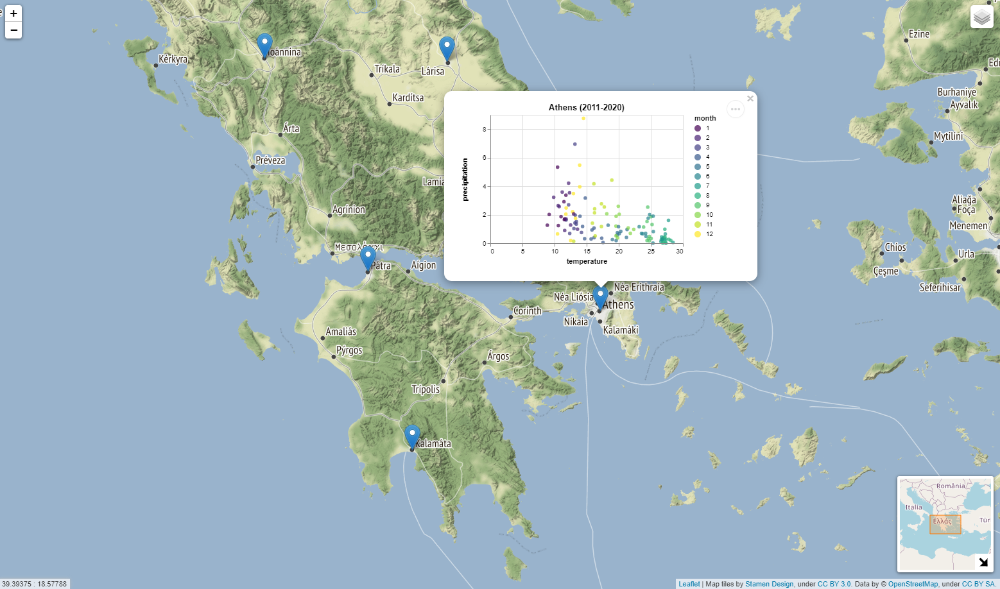

# Geospatial Data Analysis Projects
My projects for the MSc course 'Geospatial data analysis'.

### Project 1: Harmonic analysis of NDVI time series using Google Earth Engine

### Project 2: Postgres database, analysis of weather time-series and folium map 

### Project 3: Classification and semantic segmentation of satellite images with PyTorch
- Lab 5.ipynb: Classification of Sentinel-2 imagery as land or water using simple MLP
- Lab 6.ipynb: Classification of EuroSAT Dataset (RGB version) images using simple CNN, CNN with skip connections and transfer learning with ResNet-152
- Lab 7.ipynb: Semantic segmentation of Hyperspectral images using UNet

